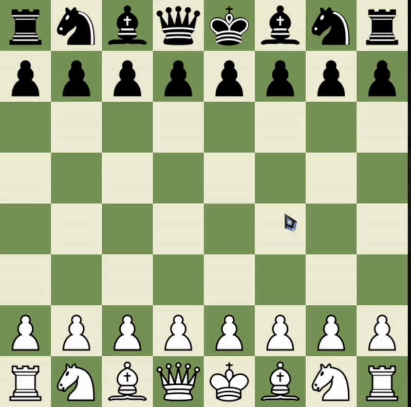
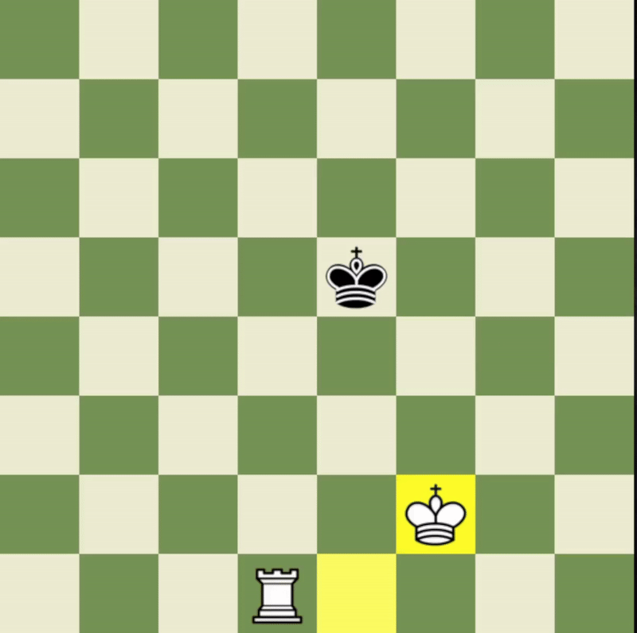
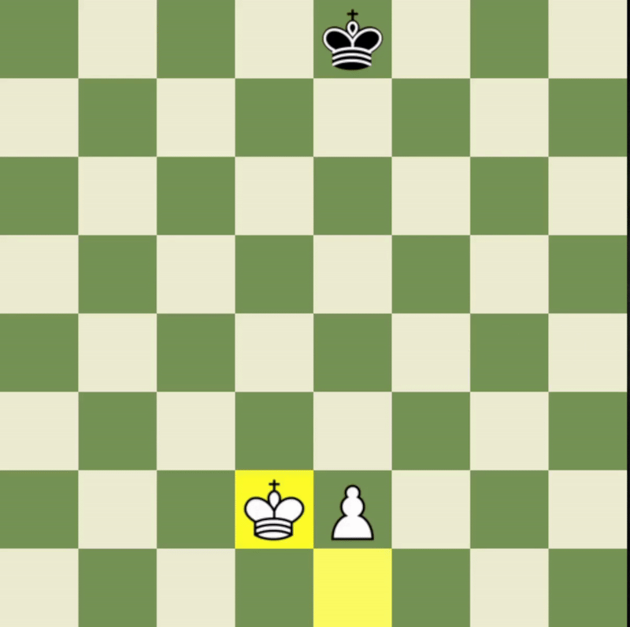

# Cow - chess engine

## Giới thiệu
Cow có sức mạnh ngang bằng bot Wally (1800 ELO) trên chess.com.
Cow đã đấu với Wally 10 trận (5 trận quân trắng, 5 trận quân đen) và thắng với tỉ số 7-3
> 

## Thuật toán:
### Cow sử dụng thuật toán tìm kiếm minimax, kết hợp với một loạt kỹ thuật sau:
- Alpha-Beta Pruning
- Move Ordering
- Null Move Pruning
- Transposition table
- Quiescence search
### Hàm đánh giá:
- Simplified Evaluation
- PeSTO's Evaluation
- Tapered Eval
### Khai cuộc
Sử dụng sách khai cuộc chứa tới 14 nước đi, được lấy từ 467.636 trận đấu CCRL 40/15 của các phần mềm cờ vua có Elo từ 3210.
> 

### Tàn cuộc
Sử dụng thêm các bảng cơ sở dữ liệu Syzygy 3-4-5 quân để hỗ trợ đánh giá. Thông tin bổ sung bao gồm WDL và DTZ50
> 

> 

> 

## Hướng dẫn:
Chạy main.py

## Yêu cầu:
- Python
- Pygame

